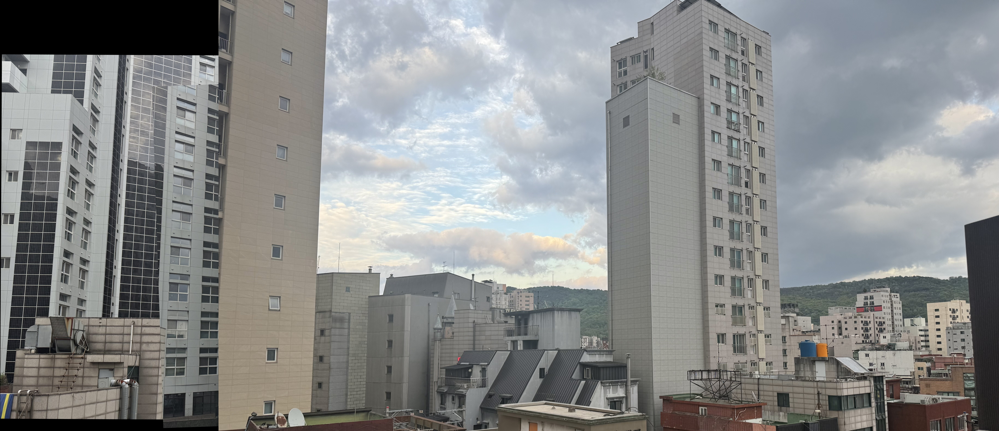

# image-stitching-project
Image stitching using feature matching and affine transformation

## Overview

This project implements an image stitching algorithm that automatically aligns multiple images and creates a single panoramic image.
The method is implemented from scratch using feature detection, feature matching, and affine transformation.

---

## Features

* ORB feature detection
* Feature matching using BFMatcher
* Affine transformation (to reduce distortion)
* Image warping and alignment
* Overlap handling by pixel replacement (reduces ghosting artifacts)

---

## Method

1. Detect keypoints and descriptors using ORB
2. Match features between images using BFMatcher
3. Estimate transformation using affine transformation (RANSAC)
4. Warp images into a common coordinate system
5. Combine images by replacing overlapping regions

---

## Why Affine Transformation?

Instead of using homography, affine transformation was used to reduce excessive distortion.
This is suitable for planar scenes with small perspective changes.

---

## How to Run

```bash
pip install opencv-python numpy
python main.py
```

---

## Input Images

* Images were captured manually
* 3 images with overlapping regions
* Camera rotated horizontally for panorama

---

## Result

Final stitched panorama:



---

## Notes

* Images must have sufficient overlap for proper matching
* Large perspective changes may reduce accuracy
* Cropping was applied to remove black borders

---

## Repository Description

Image stitching using feature matching and affine transformation
